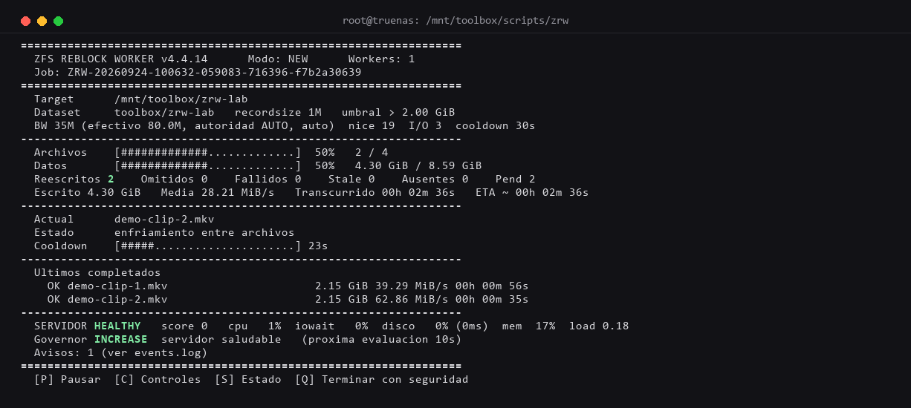

# ZFS Reblock Worker

Worker en Bash para **TrueNAS SCALE / Linux**<sup id="cite_ref-25-es">[[25]](#cite_note-25)</sup> que reescribe archivos grandes dentro de su propio dataset para que sus bloques pasen a usar el `recordsize` que el dataset ya tiene configurado. Lo hace sin arriesgar los datos: cada archivo se copia, se verifica con hash criptográfico, y recién entonces reemplaza al original con un `rename` atómico — nunca lo trunca ni lo sobreescribe en el lugar.

Bash worker for **TrueNAS SCALE / Linux**<sup id="cite_ref-25-en">[[25]](#cite_note-25)</sup> that rewrites large files inside their own dataset so their blocks switch to whatever `recordsize` the dataset already has configured. It does this without risking the data: every file is copied, verified with a cryptographic hash, and only then replaces the original via an atomic `rename` — it never truncates or overwrites the original in place.

**[Leer en español ↓](#español)** · **[Read in English ↓](#english)**

<p align="center">
  
</p>
<p align="center"><em>The live dashboard mid-run, captured from a real job against a disposable test dataset (colors rendered from the actual ANSI the tool printed — not a mockup).</em></p>

---

# Español

Versión actual: **4.4.14**.

## Qué tan probado está esto

Dieciséis rondas de pruebas, la enorme mayoría contra ZFS real (no
simulado), sobre el mismo TrueNAS de referencia. No es un simulacro:
sobrevivió **dos reinicios reales de la máquina** a mitad de copia (uno
planeado, uno por un corte eléctrico real), un `kill -9`, dos workers
reales simultáneos sobre el mismo job, y `Ctrl+C` real — en todos los casos
el archivo original quedó intacto. Reblockeó **`Musicales` completo y
`Videos/Series` completo en producción real** (2.1 TiB, 238 archivos, 0
fallos, ~17% del dataset `toolbox/media` de 12 TiB) — no copias
descartables, verificado con hash, ACL, `mtime` y `zdb`. Una sesión
completa de consola interactiva en vivo (teclas `[P]`/`[Q]`/`[C]`, wizard,
explorador de directorios) encontró y corrigió tres bugs reales; la ronda
de producción a escala encontró y corrigió cinco más (governor, memoria,
config de resume) — ninguno de los ocho comprometió jamás la integridad del
original. Todo documentado ronda por ronda en [`docs/testing/`](docs/testing/)
(la evidencia cruda de cada ronda, y el análisis de hardware/ZFS, quedan
solo en local — ver la nota al pie de esa sección).

Rondas 14 y 15 cerraron los últimos ítems de laboratorio que quedaban
abiertos: `--hash b3` contra un `b3sum` real, un dataset `nfsv4` real
quedando fuera del inventario al ocultar sus herramientas ACL, un árbol sin
ningún verificador terminando en código `20` antes de tocar nada, y la
pausa segura por espacio insuficiente sin tocar el pool real (`quota` en un
dataset descartable). La ronda 16 fue la de producción a escala: detalle en
[`docs/testing/ronda-16-produccion-series-completa/`](docs/testing/ronda-16-produccion-series-completa/).

Lo que todavía no se probó: el resto del dataset (`toolbox/media` tiene 12
TiB; `Musicales` + `Series` cubrieron ~2.1 TiB), y ACL POSIX no
trivial/`atime=on` reales sobre un dataset de producción (solo verificado
en un dataset de laboratorio descartable — no hay forma de probar esto
sobre datos reales sin cambiarle esas propiedades a un dataset de
producción). El resto del dataset es, a propósito, una decisión de rollout
y no un test: seguir el camino por etapas que ya describe la
[sección J de `docs/TEST-PLAN.md`](docs/TEST-PLAN.md).

---

## Por qué existe

Un administrador cambia el `recordsize` de un dataset de su valor por defecto a 1M. Ese cambio **solo afecta a las escrituras nuevas**<sup id="cite_ref-1-es">[[1]](#cite_note-1)</sup>: los archivos que ya están ahí conservan el tamaño de bloque con el que se escribieron, así que el `zfs set` por sí solo no convierte nada. Para que el cambio sea real hay que reescribir los archivos grandes.

Y al reescribirlos no deben perder su identidad: **`mtime` y `atime` tienen que conservar su timestamp original**. Un archivo reblockeado debe ser indistinguible del original salvo por cómo ZFS lo guarda por debajo.

Eso es exactamente lo que hace este worker, archivo por archivo, de forma transaccional:

```
ORIGINAL ──rsync -aAXS──▶ TEMPORAL (mismo directorio)
                              │
                     verificación completa
                              │
                        rename atómico
                              │
                           ORIGINAL
```

## Qué NO hace

- **No cambia el `recordsize` del dataset.** Si el dataset no tiene ya el recordsize esperado, el worker se detiene y le dice al administrador qué comando ejecutar. Nunca lo ejecuta por su cuenta.
- **No toca hardlinks.** Reemplazar el inode rompería el enlace, así que los marca `SKIPPED`.
- **No borra temporales huérfanos.** Podrían contener una copia completa: van a cuarentena.
- **No mata otra instancia.** Si hay un worker corriendo sobre el mismo job, avisa y sale.
- **No paraleliza por defecto.** `--workers` existe y funciona, pero el default es 1: con archivos delicados dos escrituras simultáneas sobre el mismo pool son justamente lo que no se quiere. Cuando se usa, el BW configurado se reparte entre los workers para que el techo del operador se respete en total.
- **No confía ciegamente en `zdb`.** Ver [zdb es advisory](#zdb-es-advisory).

---

## Contrato de seguridad

Estas once propiedades son invariantes: no hay opción de línea de comandos que las desactive.

1. **Inventario snapshot.** Un job procesa exactamente el universo detectado al empezar. Nunca crece solo.
2. **Copia a un temporal en el mismo directorio**, para garantizar que el commit es un rename dentro del mismo dataset.
3. **Identidad del origen verificada** (tamaño + inode + mtime) antes de copiar, durante, y otra vez justo antes del commit.
4. **Hash criptográfico** del origen contra el temporal antes del commit, y releído después (nivel `maximum`). El default es **BLAKE2b**<sup id="cite_ref-17-es">[[17]](#cite_note-17)</sup> (`--hash b2`), con la misma garantía de colisión/preimagen que SHA-256<sup id="cite_ref-19-es">[[19]](#cite_note-19)</sup> y sin su debilidad frente a length-extension — con cascada automática a BLAKE3<sup id="cite_ref-18-es">[[18]](#cite_note-18)</sup> y por último a SHA-256 si `b2sum` no está disponible (ver [Algoritmo de hash](#algoritmo-de-hash)). SHA-256 sigue siendo dependencia crítica: el worker no arranca sin `sha256sum` en el PATH, precisamente para que este último escalón nunca falte.
5. **`atime` y `mtime` capturados ANTES de leer el archivo** y restaurados explícitamente. En datasets con `atime` activo, leer modifica el atime<sup id="cite_ref-8-es">[[8]](#cite_note-8)</sup>: un `touch -r` posterior ya no sirve.
6. **Commit únicamente por rename.**<sup id="cite_ref-6-es">[[6]](#cite_note-6)</sup> El original nunca se trunca ni se sobreescribe en el lugar.
7. **Estado persistido antes y después de cada frontera relevante**, para que el proceso pueda morir en cualquier instrucción.
8. **Recuperación conservadora.** Un temporal huérfano no se promueve ni se borra: se pone en cuarentena para inspección manual.
9. **Ancla de rollback.** Un hardlink<sup id="cite_ref-7-es">[[7]](#cite_note-7)</sup> al inode original mantiene los datos previos al commit alcanzables, con coste de espacio cero, hasta que la verificación post-commit pasa. Si falla, el reemplazo va a cuarentena y el original vuelve a su nombre.
10. **El recordsize del dataset no se modifica jamás.**
11. **ACL y xattr verificados con la herramienta que exige el dataset.** Un dataset cuya `acltype` este host no sabe verificar **no se procesa**: sus archivos quedan fuera del inventario antes de copiarse, con el nombre de la herramienta que falta.

> **Premisa de diseño:** el proceso puede morir en cualquier instrucción, en cualquier momento, incluso por corte de energía, y la próxima ejecución debe poder reconstruir de forma segura qué estaba haciendo y continuar.

### El checkpoint no es la autoridad

El estado persistente acelera la reanudación, pero **la autoridad es el filesystem**. Un archivo marcado `DONE` solo se salta si sigue existiendo y su tamaño e inode coinciden con lo registrado. Si no coinciden, el estado se descarta, se registra `RECOVERED` y el archivo se vuelve a evaluar desde cero.

---

## Un path no es un filesystem

Cuando se le pasa `/mnt/toolbox`, debajo puede haber datasets hijos, otros pools, montajes que no son ZFS y directorios `.zfs`. Cada uno con su propio `recordsize` y su propio espacio libre.

Tratar todo el árbol como "el dataset de arriba" significaría comprobar el recordsize equivocado y el espacio equivocado para la mayoría de los archivos. **Eso sería un defecto nuestro, no un error del operador.** Por eso el worker:

- construye un **mapa de datasets** al arrancar y resuelve **cada archivo** contra él;
- verifica el `recordsize` del dataset que **realmente contiene** ese archivo;
- mide el espacio libre sobre **ese mismo** dataset;
- **nunca entra en `.zfs`**;
- deja fuera del inventario los archivos de datasets no aptos, con el motivo en el resumen — en vez de admitirlos para después fallar;
- y te dice, **antes de tocar un byte**, cuántos datasets abarca el árbol y cuáles va a omitir:

```
[DATASET] El arbol abarca 3 datasets (2 con recordsize=1M, 1 con otro).
[DATASET]   OK    toolbox/media      recordsize=1M    /mnt/toolbox/media
[DATASET]   OK    toolbox/media/4k   recordsize=1M    /mnt/toolbox/media/4k
[DATASET]   OMITE toolbox/media/docs recordsize=128K  /mnt/toolbox/media/docs
```

`--cross-dataset skip|process|stop` fija la política y `--one-dataset` restringe el recorrido al dataset del directorio indicado.

Lo que decida hacer el operador con su pool es su responsabilidad. Que el worker no se atore por diseño es la nuestra.

---

## Estados de un archivo

| Estado | Significado |
|---|---|
| `PENDING` | en el inventario, todavía sin procesar |
| `PROCESSING` | copia en curso |
| `VERIFYING` | copia terminada, verificación en curso |
| `DONE` | commit hecho y verificado |
| `SKIPPED` | no corresponde procesarlo (hardlink) |
| `FAILED` | falló tras agotar los reintentos; el original quedó intacto |
| `STALE` | el archivo cambió respecto del inventario o durante la operación |
| `MISSING` | estaba en el inventario y ya no existe |
| `RECOVERED` | el estado guardado no coincidía con el filesystem; se reevaluó |

Tras un reinicio, `PROCESSING` y `VERIFYING` vuelven a `PENDING`.

---

## Uso

### Wizard (sin argumentos)

```bash
./zfs-reblock-worker.sh
```

El wizard es **consciente del estado**: antes de ofrecer nada detecta si hay un trabajo anterior, en qué quedó, cuántos archivos fallaron y si dejó temporales huérfanos, y muestra solo las opciones que tienen sentido en esa situación.

Incluye explorador de directorios. Usa `whiptail`, `dialog` o `fzf` si están disponibles; si no hay ninguno, usa un selector integrado en Bash puro. **Nunca es motivo de fallo.**

### CLI (con argumentos)

Con argumentos suficientes el worker **nunca** abre un prompt: es apto para `cron`, `tmux` y automatización.

```bash
# Comportamiento operativo idéntico al V2
./zfs-reblock-worker.sh /mnt/toolbox/media

# Cambiando solo el límite de I/O
./zfs-reblock-worker.sh /mnt/toolbox/media --bwlimit 20M --adaptive guarded

# Simulación: no crea job ni modifica nada
./zfs-reblock-worker.sh /mnt/toolbox/media --dry-run

# ¿Está este servidor listo? No toca ningún archivo.
./zfs-reblock-worker.sh --check

# ¿Por qué procesarías (o no) este archivo?
./zfs-reblock-worker.sh --explain /mnt/toolbox/media/pelicula.mkv

# Estado de los trabajos
./zfs-reblock-worker.sh --status
./zfs-reblock-worker.sh --status /mnt/toolbox/media

# Reanudar, reintentar, revalidar
./zfs-reblock-worker.sh --job ZRW-... --resume
./zfs-reblock-worker.sh --job ZRW-... --retry-failed
./zfs-reblock-worker.sh --job ZRW-... --retry-stale

# Ventana de mantenimiento: parar solo, sin supervisión
./zfs-reblock-worker.sh /mnt/toolbox/media --stop-at 06:00
./zfs-reblock-worker.sh /mnt/toolbox/media --stop-after 50
```

Ver `--help` para la lista completa de opciones.

### El dashboard

La consola no es un log que corre: es una interfaz operacional que contesta, de un vistazo, dónde está, qué está haciendo, cuánto hizo, cuánto falta y a qué velocidad.

```
  Archivos     [##########................]  41%   98 / 238
  Datos        [#######...................]  29%   2.31 TiB / 7.84 TiB
  Reescritos 42    Omitidos 56    Fallidos 0    Stale 0    Ausentes 0
  Escrito 1.84 TiB   Media 34.7 MiB/s   Transcurrido 14h 52m 03s   ETA ~ 04h 37m 12s

  Actual       Serie Ejemplo S02E03.mkv
  Estado       REESCRIBIENDO (rsync)
  [##############............]  56%  4.71 GiB / 8.42 GiB  34.8 MiB/s  ETA 02:07  intento 1

  Ultimos completados
    OK Programa Ejemplo S03E06.mkv       8.42 GiB   34.9 MiB/s  00h 04m 07s
```

Hay **dos barras de progreso** a propósito: 98 de 238 archivos no significa lo mismo si uno pesa 2 GiB y otro 80 GiB. El progreso por bytes es el que dice cuánto trabajo queda de verdad, y de ahí sale el ETA.

Durante el `sleep` entre archivos se muestra la cuenta regresiva, para que nadie piense que el worker se colgó. El log conserva el detalle completo: la consola no lo reemplaza.

Si la salida no es un TTY, todo esto se desactiva solo y queda texto plano.

### Operación desatendida y por SSH

Un reblock de varios TB dura días. El worker está pensado para lanzarse por SSH y quedar corriendo:

```bash
# Dentro de tmux: sobrevive a la desconexión
tmux new -s zrw
./zfs-reblock-worker.sh /mnt/toolbox/media --ui plain

# O directamente en background, sin terminal
nohup ./zfs-reblock-worker.sh /mnt/toolbox/media --ui quiet --log-file /mnt/toolbox/zrw.log &

# Y se consulta desde otra sesión, sin tocar el job en curso
./zfs-reblock-worker.sh --status --json
```

`--ui` decide cómo se ve, no qué hace:

| Modo | Para qué |
|---|---|
| `auto` | dashboard si hay terminal, texto plano si no *(default)* |
| `dash` | dashboard completo |
| `plain` | una línea por evento, con timestamp |
| `quiet` | solo avisos, errores y el resumen final |
| `json` | un evento JSON por línea; nada más en stdout |

El worker ignora `SIGHUP`<sup id="cite_ref-13-es">[[13]](#cite_note-13)</sup>, así que una desconexión de SSH no lo mata. Aun así, `tmux` sigue siendo la recomendación: permite volver a ver el dashboard y usar los controles.

### Probar contra un NAS real sin tocar nada

`remote/` trae un runner por SSH que **es de solo lectura por defecto**:

```bash
cp remote/zrw-remote.conf.example remote/zrw-remote.conf
chmod 600 remote/zrw-remote.conf     # completar host, usuario, llave y target

./remote/zrw-remote.sh discover      # 1. qué hay en ese servidor (solo lectura)
./remote/zrw-remote.sh check         # 2. preflight del worker ahí
./remote/zrw-remote.sh dryrun        # 3. inventario, clasificación y estimación
./remote/zrw-remote.sh tests         # 4. los bancos del worker, en el NAS
./remote/zrw-remote.sh all           # los cuatro de una, con resumen al final
```

Ese orden importa: `discover` es lo único que puede contestar qué `acltype` usan los datasets y qué herramientas hay, que es exactamente de lo que depende `check` para decir READY o salir con `20`.

Guarda todo en `remote/results/<timestamp>/`, y `all` cierra con un resumen que traduce el código de salida de cada etapa. El modo `run`, el único que escribe, exige `ZRW_ALLOW_WRITE=yes` en el archivo de configuración **y** que se escriba el nombre del host para confirmar.

La autenticación es solo por llave SSH; el archivo de configuración está en `.gitignore`.

**Desde Windows** hay dos caminos, y los dos sirven.

*Git Bash*, sin mover nada: el `ssh` de MSYS aplica reglas de permisos POSIX a una llave guardada en NTFS, donde esos bits no significan nada, y la rechaza. El OpenSSH de Windows lee la ACL y acepta la misma llave, así que alcanza con nombrarlo en el config:

```bash
ZRW_SSH_BIN="/c/Windows/System32/OpenSSH/ssh.exe"
ZRW_SCP_BIN="/c/Windows/System32/OpenSSH/scp.exe"
```

Git Bash no trae `rsync`, así que el staging usa el camino con `scp`: funciona igual, solo es más lento.

*WSL*, lo más parecido a producción (bash real y `rsync`). Ahí la llave sí tiene que vivir dentro del home de WSL, porque un archivo en `/mnt/c` se ve con permisos `0777` y `ssh` lo rechaza:

```bash
wsl -d Ubuntu
cp /mnt/c/Users/<usuario>/.ssh/<llave> ~/.ssh/ && chmod 600 ~/.ssh/<llave>
cd /mnt/c/Users/<usuario>/source/repos/zfs-reblock-worker
bash remote/zrw-remote.sh discover
```

### Medir el rendimiento real antes de decidir

```bash
./zfs-reblock-worker.sh /mnt/toolbox/media --dry-run --dry-sample 5
```

Lee cinco candidatos completos (solo lectura) y calcula el throughput real de ese pool, en vez de estimar con el límite teórico. La diferencia entre ambos suele ser el dato que decide si un lote dura 40 horas o 90.

### Controles durante la ejecución (en TTY)

| Tecla | Acción |
|---|---|
| `P` | pausa después de terminar el archivo actual |
| `C` | cambiar parámetros en caliente |
| `S` | volcar el estado al log |
| `Q` | terminar de forma segura tras el archivo actual |

Los cambios de BW se aplican al siguiente `rsync`; `nice`/`ionice`, al siguiente hijo. `recordsize` y `threshold` definen el universo del job: se preparan para el **próximo** job o inventario y nunca alteran el actual — congelados en variables propias apenas se resuelve la configuración del job, así que cambiarlos en caliente para el próximo no puede afectar retroactivamente al que está corriendo (confirmado en vivo: encontró y corrigió un bug real donde sí lo afectaba).

`Ctrl+C` (o una señal `TERM`) termina el proceso de verdad: limpia el temporal no comprometido y el ancla de rollback, y sale — no dos veces, no hace falta repetirlo.

El dashboard usa color para ayudar a encontrar los datos de un vistazo (contadores, salud del servidor, qué está haciendo el governor, si hay un techo de BW manual puesto) — se desactiva solo con `NO_COLOR=1`, `--no-color`, o si la salida no es una terminal.

---

## Defaults heredados del V2

Invocar el worker solo con el directorio produce exactamente el comportamiento operativo del V2:

| Parámetro | Default |
|---|---:|
| candidatos | > 2 GiB |
| recordsize esperado | 1M |
| BW limit | 35M |
| nice | 19<sup id="cite_ref-12-es">[[12]](#cite_note-12)</sup> |
| ionice | clase 3 (idle)<sup id="cite_ref-11-es">[[11]](#cite_note-11)</sup> |
| cooldown entre archivos | 30 s |
| margen de espacio | máx(20 %, 1 GiB) |
| reintentos | 2 |
| integridad | `maximum` |
| governor | `auto` |

V3 no sorprende: extiende el V2, no cambia silenciosamente cómo trabaja.

---

## Niveles de integridad

| Nivel | Qué hace |
|---|---|
| `standard` | tamaño + verificación de transferencia de rsync |
| `strict` | + hash del original y del temporal antes del commit *(default)* |
| `maximum` | + relectura completa después del commit |

El default es `strict`: el hash pre-commit es la garantía que impide reemplazar un archivo con contenido distinto, y es la que hay que tener.

`maximum` añade una relectura completa de cada archivo ya comprometido. Sobre un lote de varios TB eso es **aproximadamente un 33 % más de I/O de lectura**, y el worker lo dice en pantalla cuando se activa. Vale la pena cuando el pool es sospechoso o los archivos son críticos; no como default.

### Algoritmo de hash

| `--hash` | Qué es | Cuándo |
|---|---|---|
| `b2` | BLAKE2b (`b2sum` de coreutils): criptográfico, misma garantía que SHA-256, ~3x más rápido (167 MB/s → 482 MB/s medido en el NAS de referencia) | **default** |
| `b3` | BLAKE3 (`b3sum`), si está instalado: misma garantía, más rápido todavía | fallback automático de `b2` si falta `b2sum`; también invocable a mano |
| `sha256` | criptográfico, el fallback final — dependencia crítica, siempre presente | si faltan `b2sum` y `b3sum`, o pedido a mano |
| `md5` | el más rápido, pero roto frente a colisiones<sup id="cite_ref-20-es">[[20]](#cite_note-20)</sup> | solo como detector de corrupción accidental |

El default es `b2`, con cascada automática: si `b2sum` no está, prueba `b3sum`; si tampoco, cae en `sha256sum` (que nunca falta, porque es dependencia crítica del worker). Ninguno de los tres primeros resigna la garantía criptográfica del contrato — la cascada existe por velocidad, no por seguridad. `md5` sigue disponible aparte porque a veces es lo único que hay, y el worker avisa de lo que implica cada vez que se pide explícitamente.

`b3sum` (BLAKE3) ya está instalado en el NAS de referencia y validado contra un archivo real (ronda 14): mismo formato de salida que `sha256sum`/`b2sum`, sin ningún ajuste de parseo necesario.

---

## Adaptive Resource Governor

Antes de tocar el primer archivo, el worker observa el servidor durante unos segundos y establece un **baseline**. Después, mientras trabaja, calcula un *health score* a partir de CPU, I/O wait, load normalizado por CPU y memoria, **y de cuánto se desvía todo eso del baseline** — la pregunta no es solo "¿está la CPU al 80 %?", sino "¿cuánto estoy alterando el comportamiento normal de este servidor?".

El I/O wait pesa más que la CPU, porque en un reblock el recurso delicado es el almacenamiento.

La lectura de memoria descuenta el ARC de ZFS<sup id="cite_ref-2-es">[[2]](#cite_note-2)</sup> que sería reclamable sin problema (su tamaño actual menos su propio piso configurado) — sin este ajuste, un host sano con el ARC cerca de su techo (normal en ZFS, hasta ~95% de la RAM) se leía como si esa memoria estuviera comprometida de verdad, inflando la presión sin que hubiera ningún problema real (ver `CHANGELOG.md`, 4.4.8).

Después de una pausa protectiva, `AUTO` no vuelve a subir el BW con la primera muestra sana: espera un enfriamiento corto (por defecto, 3 intervalos de salud) para no chocar de nuevo con la siguiente ráfaga periódica de sincronización de ZFS<sup id="cite_ref-5-es">[[5]](#cite_note-5)</sup> — confirmado en vivo contra un disco único lento, donde sin este margen el ciclo era subir, chocar, pausar, subir, chocar, en casi cada archivo (ver `CHANGELOG.md`, 4.4.10).

Si el dataset objetivo vive en un disco conectado por USB, el worker lo avisa una vez al arrancar un job nuevo (o en `--dry-run`): un disco USB, sobre todo si es único y sin mirror/raidz, suele tener un techo de escritura sostenida bien por debajo de su velocidad nominal — vale la pena medirlo con `--dry-run --dry-sample` y fijar `--bwlimit`/`--bw-max` cerca de ese número, en vez de dejar que el governor lo descubra solo (ver `CHANGELOG.md`, 4.4.11).

El puntaje de presión también le da crédito a la evidencia de que el disco sigue entregando: si el archivo que se está copiando ahora mismo lleva unos segundos en curso y su velocidad real alcanza el mínimo configurado (`--bw-min`), la severidad baja un poco — un disco al 100% de uso entregando bytes de verdad no es lo mismo que uno al 100% y atascado, aunque `%util`/PSI<sup id="cite_ref-10-es">[[10]](#cite_note-10)</sup> por sí solos no puedan distinguirlos (mismo principio que usan TCP BBR<sup id="cite_ref-15-es">[[15]](#cite_note-15)</sup> y los limitadores de concurrencia adaptativa<sup id="cite_ref-16-es">[[16]](#cite_note-16)</sup>). Nunca inventa presión que las demás señales no vieran, solo la suaviza cuando hay trabajo real en curso (ver `CHANGELOG.md`, 4.4.14).

Con `--adaptive off`, el governor deja de actuar (sin `THROTTLE`, sin `INCREASE`, sin pausa protectiva automática — la autoridad queda enteramente en el operador), pero **sigue midiendo**: el panel "SERVIDOR" del dashboard refleja la salud real del servidor en todo momento, no un valor congelado (ver `CHANGELOG.md`, 4.4.14).

| Estado | Acción de AUTO |
|---|---|
| `HEALTHY` | sube el BW gradualmente |
| `BUSY` | mantiene |
| `PRESSURE` | baja el BW |
| `CRITICAL`/`EMERGENCY` sostenido | pausa protectiva: no arranca archivos nuevos |

Modos: `off` (nada automático), `auto` (sube y baja), `guarded` (solo puede bajar).

### Pausa protectiva: por defecto se detiene, no reanuda sola

Ante presión crítica sostenida, el comportamiento **por defecto** es salir
con código `13` y esperar un `--resume` manual — el mismo camino que
cualquier otra pausa. Con **`--auto-resume`**, el worker en cambio espera
*dentro del mismo proceso*, volviendo a muestrear la salud del servidor, y
retoma solo en cuanto la ve sostenidamente sana de nuevo — sin salir, sin
necesitar `--resume`. Acotado por `--pause-timeout MIN` (120 por defecto):
si la presión nunca cede, se rinde y sale como siempre, para que nunca
quede colgado en silencio. Validado con presión real (`fio`) sobre el
servidor de referencia: pausó, quedó vivo esperando, y reanudó solo 40s-3m
después de que la presión bajó, con código de salida final `0` — `--resume`
nunca invocado.

Solo la pausa que dispara **el governor** es elegible para `--auto-resume`:
un `[P]`/`[Q]` del operador o el disco lleno siempre detienen el job de
verdad, sin excepción.

```bash
./zfs-reblock-worker.sh /mnt/toolbox/media --auto-resume --pause-timeout 60
```

### Autoridad del operador

**Regla de oro:** el sistema automático optimiza dentro de los límites del operador, pero nunca por encima de una decisión explícita suya.

Si usted baja el BW a 20M desde el menú `[C]`, eso es un **techo absoluto**:

- AUTO puede bajar **por debajo** de 20M si aparece presión.
- AUTO **no** puede volver a subirlo, ni aunque el servidor quede completamente ocioso.
- Solo `[C] → a) Devolver autoridad de BW a AUTO` restituye ese permiso.

Confirmado en vivo, contra presión real: con el techo en 20M subió hasta
exactamente 20.0M y se detuvo ahí; bajo presión real bajó a 16M; y al
devolver la autoridad con `a`, volvió a subir libre hasta 47.8M.

El governor solo gobierna el ancho de banda y el cooldown. Nunca toca recordsize, threshold, integridad, preservación de metadatos ni la estrategia de commit: esos no son aceleradores, son la definición del trabajo.

---

## zdb es advisory

`zdb` se usa para registrar una pista sobre el tamaño de bloque, y nada más.

Concretamente se lee la columna **`dblk`** de `zdb -O`, localizada por su encabezado: el tamaño de bloque en disco. No `lsize`, que es el tamaño lógico del archivo y por lo tanto no responde nada — un archivo de 2 GiB reporta 2 GiB esté en bloques de 128K o de 1M. Leer `lsize` es lo que hacían las versiones anteriores, y correr la sonda sobre el servidor real es lo que lo puso en evidencia.

Aun leyendo el campo correcto, su salida textual es una interfaz de depuración inestable<sup id="cite_ref-4-es">[[4]](#cite_note-4)</sup>, y un `dblk` de 1M **no demuestra** que todos los bloques de datos del archivo sean de 1 MiB. Por eso el worker nunca salta un archivo basándose solo en esa pista: la registra como evidencia de diagnóstico y sigue con el proceso seguro completo.

Preferimos reprocesar algún archivo que podríamos haber saltado, antes que declarar correcto uno que no lo está.

"Advisory" también es una promesa sobre el *tiempo*, no solo sobre la decisión: `zdb -O` camina la metadata del pool directamente en disco, y en un pool con un único disco físico compitiendo con un scrub real se lo vio bloqueado más de 7 minutos — congelando el job entero, sin copiar un solo byte, por una pista que por diseño nunca debía decidir nada. Por eso la llamada está acotada con `timeout` (5 segundos): un `zdb` que no responde a tiempo vuelve `UNKNOWN`, igual que si no estuviera instalado.

---

## Estructura de un job

```text
jobs/ZRW-<fecha>-<nanos>-<pid>-<hash>/
├── config.env         configuración congelada del job
├── inventory.tsv      snapshot (publicado atómicamente)
├── state/             un archivo de estado por candidato
├── quarantine/        temporales huérfanos rescatados
├── events.log         log humano
├── journal.tsv        journal estructurado (timestamp, estado, inode, size, resultado, path)
├── summary.tsv        resumen machine-readable
└── summary.json       resumen machine-readable
```

Los nombres de archivo se guardan con `printf %q` y se recorren con `find -print0`: espacios, tabs, comillas, `$`, backticks, globs y **saltos de línea** dentro de un nombre están cubiertos.

Los temporales se llaman `.zrw-<token-del-job>-<token-del-archivo>.tmp`. Gracias a eso, la recuperación distingue un temporal propio de uno de otro job, y **nunca toca el ajeno**.

---

## Códigos de salida

Son semánticos a propósito: un script tiene que poder distinguir una dependencia ausente de un `recordsize` que no coincide sin parsear texto.

| Código | Significado |
|---:|---|
| 0 | todo correcto, o job pausado de forma segura |
| 1 | error de uso o configuración inválida |
| 10 | se requiere UID 0 |
| 11 | otro worker ya tiene este job tomado |
| 12 | el job terminó con al menos un archivo en `FAILED` |
| 13 | el job se detuvo antes de tiempo (espacio, operador, governor) |
| 14 | condición interna inesperada |
| 20 | falta una dependencia crítica, o ningún dataset del árbol es verificable |
| 21 | un comando existe pero no funciona |
| 22 | el objetivo no está dentro de un dataset ZFS identificable |
| 23 | el `recordsize` del dataset no es el esperado |

---

## Dependencias

**Críticas** (sin ellas el worker no arranca): `bash awk find sort grep sed head tail uniq stat df date sleep touch mv rm mkdir dirname basename` `rsync`<sup id="cite_ref-24-es">[[24]](#cite_note-24)</sup> `flock`<sup id="cite_ref-9-es">[[9]](#cite_note-9)</sup> `zfs sync sha256sum id kill`, más UID 0.

**Según la `acltype`<sup id="cite_ref-3-es">[[3]](#cite_note-3)</sup> del dataset** — no son opcionales para ese dataset, son la condición para poder procesarlo:

| `acltype` | Necesita | Si falta |
|---|---|---|
| `nfsv4` | `nfs4xdr_getfacl` + `jq` | ese dataset queda fuera del inventario |
| `posix` | `getfacl` + `getfattr` | ídem |
| `off` | `getfattr` | ídem |

Si ningún dataset del árbol tiene su herramienta, el worker sale con `20` sin tocar un archivo. En un TrueNAS SCALE con datasets NFSv4, eso significa `nfs4xdr_getfacl` y `jq`.

**Opcionales** (degradación controlada y avisada, nunca fallo silencioso): `zdb nice renice ionice realpath readlink whiptail dialog fzf b2sum b3sum timeout`. Sin `timeout`, una llamada a `zdb -O` que se cuelgue (visto en vivo: varios minutos, compitiendo con un scrub real por I/O de metadata) puede bloquear el job entero — con `timeout` presente, se corta a los 5 segundos y la pista vuelve `UNKNOWN`. Sin `b2sum` ni `b3sum`, el hash cae en `sha256sum` — nunca falta, es dependencia crítica.

El preflight no se limita a comprobar que el binario existe: verifica que `zfs` responde y que puede listar datasets. Si `renice` o `ionice` faltan, el worker continúa pero **lo dice en el log**, para que después se sepa en qué condiciones se ejecutó el trabajo.

---

## Antes de usarlo sobre datos reales

Los tests de `tests/` pasan (estático, unitario, y un banco de integración
completo con ZFS simulado), pero **un `bash -n` que pasa no prueba nada
sobre ZFS real** — por eso existe [`docs/TEST-PLAN.md`](docs/TEST-PLAN.md):
el plan completo, sección por sección, con qué se probó, cómo, y contra qué
evidencia. Ya se ejecutó de punta a punta sobre el TrueNAS de referencia —
ver ["Qué tan probado está esto"](#qué-tan-probado-está-esto) más arriba y
[`docs/testing/`](docs/testing/) para la evidencia cruda, ronda por ronda.

Sobre **su propio** servidor, el mismo camino sigue siendo el correcto:

```bash
sudo bash remote/zrw-discovery.sh                     # solo lectura: acltype, herramientas, zdb real
sudo bash remote/zrw-discovery.sh --probe-write       # incluye un ida y vuelta real

bash tests/test_static.sh        # revisión estática
bash tests/test_units.sh         # funciones puras
bash tests/test_integration.sh   # ciclo completo con ZFS simulado
```

Y para lo que un banco automático no puede responder por sí solo — reblockear
archivos reales, un reinicio real, controles en vivo — `docs/TEST-PLAN.md`
tiene el detalle completo, y [Live Console Protocol](https://github.com/hnacimiento/zfs-reblock-worker/wiki/Live-Console-Protocol) un protocolo
paso a paso para la parte que necesita alguien tecleando en una consola real.

### Herramientas auxiliares para probar sin arriesgar datos reales

- **`remote/zrw-lab-dataset.sh`** — crea y destruye un dataset ZFS
  descartable (`--acltype posix|nfsv4 --atime on|off`), para los casos que
  el dataset de producción no puede prestar (una ACL POSIX no trivial,
  `atime=on`) sin tocar nada real. `destroy` solo acepta nombres que
  empiecen con `zrw-lab`, como piso de seguridad.
- **`remote/zrw-deep-observe.sh`** — observabilidad de solo lectura para un
  worker corriendo, apoyada enteramente en `/proc` (árbol de procesos, I/O
  real por proceso, descriptores de archivo abiertos, memoria, cgroup,
  `iostat`/`zpool iostat`). Pensada para acompañar una sesión de consola en
  vivo, ver [Live Console Protocol](https://github.com/hnacimiento/zfs-reblock-worker/wiki/Live-Console-Protocol).

---

## Documentación

> La evidencia cruda de cada ronda de pruebas (`.txt`/`.log` con la salida
> real de comandos contra el servidor, y el análisis de hardware en
> `analisis-disco-usb-zfs/`) no se publica: contiene nombres reales de
> archivos de la biblioteca multimedia y queda solo en local. Lo que sí
> está acá es el resumen curado de cada ronda, en `docs/testing/`.

**[Manual de referencia → Wiki del proyecto](https://github.com/hnacimiento/zfs-reblock-worker/wiki):** [Architecture](https://github.com/hnacimiento/zfs-reblock-worker/wiki/Architecture) · [Configuration](https://github.com/hnacimiento/zfs-reblock-worker/wiki/Configuration) · [Operations](https://github.com/hnacimiento/zfs-reblock-worker/wiki/Operations) · [Recovery](https://github.com/hnacimiento/zfs-reblock-worker/wiki/Recovery) · [Live Console Protocol](https://github.com/hnacimiento/zfs-reblock-worker/wiki/Live-Console-Protocol) · [Witness Design](https://github.com/hnacimiento/zfs-reblock-worker/wiki/Witness-Design)

En el repositorio en sí (versionado junto al código):

- [`docs/TEST-PLAN.md`](docs/TEST-PLAN.md) — el plan de pruebas, y el estado real de cada ítem
- [`docs/testing/`](docs/testing/) — resumen de cada ronda de pruebas contra el servidor real, ronda por ronda
- [`docs/AUDIT-V3.md`](docs/AUDIT-V3.md) — auditoría de las entregas previas y qué se corrigió
- [`CHANGELOG.md`](CHANGELOG.md) — historial completo de versiones, con la causa raíz de cada bug real encontrado
- [`document/`](document/) — documento formal del proyecto (`.docx`/`.htm`/`.pdf`), en español e inglés, firmado digitalmente (PAdES)<sup id="cite_ref-22-es">[[22]](#cite_note-22)</sup> y con marca de agua
- [`certificate/`](certificate/) — certificado público<sup id="cite_ref-21-es">[[21]](#cite_note-21)</sup> usado para firmar esos documentos, con su fingerprint SHA-256

## Plataforma de referencia

TrueNAS SCALE 26.0.0-BETA.3, kernel 6.18.42, Bash 5.2.37, rsync 3.4.1, OpenZFS 2.4.3, `whiptail` presente, `dialog`/`fzf` ausentes, `b2sum` y `b3sum` presentes, `/proc/{stat,loadavg,meminfo}`<sup id="cite_ref-14-es">[[14]](#cite_note-14)</sup> disponibles. La raíz del sistema (`/usr/bin` y similares) está montada en **solo lectura** — cualquier prueba que necesite "sacar" una herramienta del PATH tiene que hacerlo con un PATH sombra, no moviendo el binario real.

---

# English

Current version: **4.4.14**.

## How well-tested this is

Sixteen rounds of testing, the vast majority against real ZFS (not
simulated), on the same reference TrueNAS box. This isn't a simulation: it
survived **two real machine reboots** mid-copy (one planned, one from an
actual power outage), a `kill -9`, two real workers running simultaneously
on the same job, and a real `Ctrl+C` — in every case the original file came
out intact. It reblocked **all of `Musicales` and all of `Videos/Series`
in real production** (2.1 TiB, 238 files, 0 failures, ~17% of the 12 TiB
`toolbox/media` dataset) — not disposable copies, verified with hash, ACL,
`mtime` and `zdb`. A full live interactive console session (`[P]`/`[Q]`/`[C]`
keys, wizard, directory browser) found and fixed three real bugs; the
production-scale round found and fixed five more (governor, memory, resume
config) — none of the eight ever compromised the integrity of the original.
All of it documented round by round in [`docs/testing/`](docs/testing/)
(the raw evidence and hardware/ZFS analysis for each round stay local only
— see the note at the bottom of that section).

Rounds 14 and 15 closed the last lab-only items that were still open:
`--hash b3` against a real `b3sum`, a real `nfsv4` dataset correctly
falling out of the inventory when its ACL tools are hidden, a tree with no
verifier at all exiting with code `20` before touching anything, and the
safe pause on insufficient space without ever touching the real pool
(`quota` on a disposable dataset). Round 16 was the production-scale one:
details in
[`docs/testing/ronda-16-produccion-series-completa/`](docs/testing/ronda-16-produccion-series-completa/).

What still hasn't been tested: the rest of the dataset (`toolbox/media` is
12 TiB total; `Musicales` + `Series` covered ~2.1 TiB), and non-trivial
POSIX ACLs / real `atime=on` against a production dataset (only verified
on a disposable lab dataset — there's no way to test this against real
data without changing those properties on a production dataset). The rest
of the dataset is, deliberately, a rollout decision and not a test: follow
the staged path already described in
[section J of `docs/TEST-PLAN.md`](docs/TEST-PLAN.md).

---

## Why it exists

An administrator changes a dataset's `recordsize` from its default to 1M.
That change **only affects new writes**<sup id="cite_ref-1-en">[[1]](#cite_note-1)</sup>: files already sitting there keep
the block size they were originally written with, so `zfs set` alone
converts nothing. For the change to actually take effect, the large files
need to be rewritten.

And rewriting them must not change their identity: **`mtime` and `atime`
have to keep their original timestamps**. A reblocked file must be
indistinguishable from the original except for how ZFS stores it
underneath.

That's exactly what this worker does, file by file, transactionally:

```
ORIGINAL ──rsync -aAXS──▶ TEMP (same directory)
                              │
                      full verification
                              │
                        atomic rename
                              │
                           ORIGINAL
```

## What it does NOT do

- **It never changes the dataset's `recordsize`.** If the dataset doesn't already have the expected recordsize, the worker stops and tells the administrator exactly what command to run. It never runs it on its own.
- **It never touches hardlinks.** Replacing the inode would break the link, so those files are marked `SKIPPED`.
- **It never deletes orphaned temp files.** They might hold a complete copy: they go to quarantine instead.
- **It never kills another instance.** If a worker is already running on the same job, it warns and exits.
- **It doesn't parallelize by default.** `--workers` exists and works, but the default is 1: with delicate files, two simultaneous writes to the same pool are exactly what you don't want. When it's used, the configured BW is split between workers so the operator's ceiling is respected in total.
- **It doesn't blindly trust `zdb`.** See [zdb is advisory](#zdb-is-advisory).

---

## Safety contract

These eleven properties are invariants: there is no command-line option that disables them.

1. **Snapshot inventory.** A job processes exactly the universe detected when it started. It never grows on its own.
2. **Copy to a temp file in the same directory**, guaranteeing the commit is a rename within the same dataset.
3. **Source identity verified** (size + inode + mtime) before copying, during, and again right before the commit.
4. **Cryptographic hash** of the source against the temp file before the commit, and re-read afterward (at `maximum` level). The default is **BLAKE2b**<sup id="cite_ref-17-en">[[17]](#cite_note-17)</sup> (`--hash b2`), with the same collision/preimage guarantee as SHA-256<sup id="cite_ref-19-en">[[19]](#cite_note-19)</sup> and without its length-extension weakness — with an automatic cascade to BLAKE3<sup id="cite_ref-18-en">[[18]](#cite_note-18)</sup> and finally SHA-256 if `b2sum` isn't available (see [Hash algorithm](#hash-algorithm)). SHA-256 remains a critical dependency: the worker won't start without `sha256sum` on the PATH, precisely so that last fallback step is never missing.
5. **`atime` and `mtime` captured BEFORE reading the file** and explicitly restored. On datasets with `atime` enabled, reading a file changes its atime<sup id="cite_ref-8-en">[[8]](#cite_note-8)</sup>: a `touch -r` afterward is no longer enough.
6. **Commit only by rename.**<sup id="cite_ref-6-en">[[6]](#cite_note-6)</sup> The original is never truncated or overwritten in place.
7. **State persisted before and after every relevant boundary**, so the process can die at any instruction.
8. **Conservative recovery.** An orphaned temp file is never promoted or deleted: it goes to quarantine for manual inspection.
9. **Rollback anchor.** A hardlink<sup id="cite_ref-7-en">[[7]](#cite_note-7)</sup> to the original inode keeps the pre-commit data reachable, at zero space cost, until post-commit verification passes. If it fails, the replacement goes to quarantine and the original reverts to its name.
10. **The dataset's recordsize is never modified.**
11. **ACL and xattr verified with whatever tool the dataset requires.** A dataset whose `acltype` this host can't verify **is never processed**: its files are excluded from the inventory before anything is copied, with the name of the missing tool.

> **Design premise:** the process can die at any instruction, at any moment, even from a power loss, and the next run must be able to safely reconstruct what it was doing and continue.

### The checkpoint is not the authority

Persisted state speeds up resuming, but **the filesystem is the authority**. A file marked `DONE` is only skipped if it still exists and its size and inode match what was recorded. If they don't match, the state is discarded, `RECOVERED` is logged, and the file is evaluated from scratch.

---

## A path is not a filesystem

When you point it at `/mnt/toolbox`, underneath there can be child datasets, other pools, non-ZFS mounts, and `.zfs` directories. Each with its own `recordsize` and its own free space.

Treating the whole tree as "the dataset at the top" would mean checking the wrong recordsize and the wrong free space for most files. **That would be a defect of ours, not an operator mistake.** So the worker:

- builds a **dataset map** at startup and resolves **every file** against it;
- verifies the `recordsize` of the dataset that **actually contains** that file;
- measures free space on **that same** dataset;
- **never walks into `.zfs`**;
- excludes files from unfit datasets from the inventory, with the reason in the summary — instead of accepting them and failing later;
- and tells you, **before touching a single byte**, how many datasets the tree spans and which ones it's going to skip:

```
[DATASET] The tree spans 3 datasets (2 with recordsize=1M, 1 with another).
[DATASET]   OK    toolbox/media      recordsize=1M    /mnt/toolbox/media
[DATASET]   OK    toolbox/media/4k   recordsize=1M    /mnt/toolbox/media/4k
[DATASET]   SKIP  toolbox/media/docs recordsize=128K  /mnt/toolbox/media/docs
```

`--cross-dataset skip|process|stop` sets the policy, and `--one-dataset` restricts the walk to the dataset of the given directory.

Whatever the operator decides to do with their pool is their responsibility. That the worker doesn't choke by design is ours.

---

## File states

| State | Meaning |
|---|---|
| `PENDING` | in the inventory, not processed yet |
| `PROCESSING` | copy in progress |
| `VERIFYING` | copy done, verification in progress |
| `DONE` | committed and verified |
| `SKIPPED` | not applicable (hardlink) |
| `FAILED` | failed after exhausting retries; the original stayed intact |
| `STALE` | the file changed relative to the inventory, or during the operation |
| `MISSING` | was in the inventory and no longer exists |
| `RECOVERED` | the saved state didn't match the filesystem; re-evaluated |

After a restart, `PROCESSING` and `VERIFYING` revert to `PENDING`.

---

## Usage

### Wizard (no arguments)

```bash
./zfs-reblock-worker.sh
```

The wizard is **state-aware**: before offering anything it detects whether there's a previous job, what state it's in, how many files failed, and whether it left orphaned temp files — and it only shows the options that make sense for that situation.

It includes a directory browser. It uses `whiptail`, `dialog` or `fzf` if available; if none exist, it falls back to a built-in pure-Bash selector. **Never a reason to fail.**

### CLI (with arguments)

With enough arguments the worker **never** opens a prompt: fit for `cron`, `tmux`, and automation.

```bash
# Same operational behavior as V2
./zfs-reblock-worker.sh /mnt/toolbox/media

# Only changing the I/O limit
./zfs-reblock-worker.sh /mnt/toolbox/media --bwlimit 20M --adaptive guarded

# Simulation: creates no job, modifies nothing
./zfs-reblock-worker.sh /mnt/toolbox/media --dry-run

# Is this server ready? Touches no file.
./zfs-reblock-worker.sh --check

# Why would (or wouldn't) this file be processed?
./zfs-reblock-worker.sh --explain /mnt/toolbox/media/movie.mkv

# Job status
./zfs-reblock-worker.sh --status
./zfs-reblock-worker.sh --status /mnt/toolbox/media

# Resume, retry, revalidate
./zfs-reblock-worker.sh --job ZRW-... --resume
./zfs-reblock-worker.sh --job ZRW-... --retry-failed
./zfs-reblock-worker.sh --job ZRW-... --retry-stale

# Maintenance window: stop on its own, unsupervised
./zfs-reblock-worker.sh /mnt/toolbox/media --stop-at 06:00
./zfs-reblock-worker.sh /mnt/toolbox/media --stop-after 50
```

See `--help` for the full list of options.

### The dashboard

The console isn't a scrolling log: it's an operational interface that answers, at a glance, where it is, what it's doing, how much it's done, how much is left, and at what speed.

```
  Files        [##########................]  41%   98 / 238
  Data         [#######...................]  29%   2.31 TiB / 7.84 TiB
  Rewritten 42     Skipped 56      Failed 0      Stale 0      Missing 0
  Written 1.84 TiB   Avg 34.7 MiB/s   Elapsed 14h 52m 03s   ETA ~ 04h 37m 12s

  Current      Example Show S02E03.mkv
  State        REWRITING (rsync)
  [##############............]  56%  4.71 GiB / 8.42 GiB  34.8 MiB/s  ETA 02:07  attempt 1

  Last completed
    OK Example Program S03E06.mkv       8.42 GiB   34.9 MiB/s  00h 04m 07s
```

There are **two progress bars** on purpose: 98 of 238 files doesn't mean the same thing when one weighs 2 GiB and another weighs 80 GiB. The byte-based progress bar is the one that says how much work is genuinely left, and the ETA comes from it.

During the `sleep` between files, a countdown is shown, so nobody thinks the worker hung. The log keeps the full detail: the console doesn't replace it.

If the output isn't a TTY, all of this automatically turns off and stays plain text.

### Unattended operation over SSH

Reblocking several TB takes days. The worker is designed to be launched over SSH and left running:

```bash
# Inside tmux: survives disconnection
tmux new -s zrw
./zfs-reblock-worker.sh /mnt/toolbox/media --ui plain

# Or straight to background, no terminal
nohup ./zfs-reblock-worker.sh /mnt/toolbox/media --ui quiet --log-file /mnt/toolbox/zrw.log &

# And queried from another session, without touching the job in progress
./zfs-reblock-worker.sh --status --json
```

`--ui` decides how it looks, not what it does:

| Mode | For |
|---|---|
| `auto` | dashboard if there's a terminal, plain text if not *(default)* |
| `dash` | full dashboard |
| `plain` | one line per event, with a timestamp |
| `quiet` | only warnings, errors, and the final summary |
| `json` | one JSON event per line; nothing else on stdout |

The worker ignores `SIGHUP`<sup id="cite_ref-13-en">[[13]](#cite_note-13)</sup>, so an SSH disconnect doesn't kill it. Even so, `tmux` remains the recommendation: it lets you come back to the dashboard and use the controls.

### Testing against a real NAS without touching anything

`remote/` ships an SSH runner that **is read-only by default**:

```bash
cp remote/zrw-remote.conf.example remote/zrw-remote.conf
chmod 600 remote/zrw-remote.conf     # fill in host, user, key and target

./remote/zrw-remote.sh discover      # 1. what's on that server (read-only)
./remote/zrw-remote.sh check         # 2. worker preflight there
./remote/zrw-remote.sh dryrun        # 3. inventory, classification and estimate
./remote/zrw-remote.sh tests         # 4. the worker's test banks, on the NAS
./remote/zrw-remote.sh all           # all four at once, with a summary at the end
```

That order matters: `discover` is the only one that can answer what `acltype` the datasets use and what tools are present, which is exactly what `check` depends on to say READY or exit with `20`.

Everything is saved to `remote/results/<timestamp>/`, and `all` closes with a summary that translates each stage's exit code. The `run` mode — the only one that writes — requires `ZRW_ALLOW_WRITE=yes` in the config file **and** typing the hostname to confirm.

Authentication is SSH-key only; the config file is in `.gitignore`.

**From Windows** there are two paths, and both work.

*Git Bash*, without moving anything: MSYS's `ssh` applies POSIX permission rules to a key stored on NTFS, where those bits mean nothing, and rejects it. Windows' own OpenSSH reads the NTFS ACL instead and accepts the same key, so it's enough to name it in the config:

```bash
ZRW_SSH_BIN="/c/Windows/System32/OpenSSH/ssh.exe"
ZRW_SCP_BIN="/c/Windows/System32/OpenSSH/scp.exe"
```

Git Bash doesn't ship `rsync`, so staging falls back to the `scp` path: it works the same, just slower.

*WSL*, the closest thing to production (real bash and `rsync`). There, the key does have to live inside the WSL home, because a file under `/mnt/c` shows up with `0777` permissions and `ssh` rejects it:

```bash
wsl -d Ubuntu
cp /mnt/c/Users/<you>/.ssh/<your-key> ~/.ssh/ && chmod 600 ~/.ssh/<your-key>
cd /mnt/c/Users/<you>/source/repos/zfs-reblock-worker
bash remote/zrw-remote.sh discover
```

### Measuring real throughput before deciding

```bash
./zfs-reblock-worker.sh /mnt/toolbox/media --dry-run --dry-sample 5
```

Reads five full candidates (read-only) and computes that pool's real throughput, instead of estimating from the theoretical limit. The difference between the two is usually the number that decides whether a batch takes 40 hours or 90.

### Controls during a run (in a TTY)

| Key | Action |
|---|---|
| `P` | pause after the current file finishes |
| `C` | change parameters on the fly |
| `S` | dump state to the log |
| `Q` | terminate safely after the current file |

BW changes apply to the next `rsync`; `nice`/`ionice`, to the next child process. `recordsize` and `threshold` define the job's universe: they get staged for the **next** job or inventory and never alter the current one — frozen into their own variables as soon as the job's configuration is resolved, so changing them on the fly for next time can't retroactively affect the one currently running (confirmed live: found and fixed a real bug where it did).

`Ctrl+C` (or a `TERM` signal) really terminates the process: it cleans up the uncommitted temp file and the rollback anchor, and exits — not twice, no need to repeat it.

The dashboard uses color to help spot data at a glance (counters, server health, what the governor is doing, whether there's a manual BW ceiling set) — it turns off on its own with `NO_COLOR=1`, `--no-color`, or when the output isn't a terminal.

---

## Defaults inherited from V2

Invoking the worker with just the directory produces exactly V2's operational behavior:

| Parameter | Default |
|---|---:|
| candidates | > 2 GiB |
| expected recordsize | 1M |
| BW limit | 35M |
| nice | 19<sup id="cite_ref-12-en">[[12]](#cite_note-12)</sup> |
| ionice | class 3 (idle)<sup id="cite_ref-11-en">[[11]](#cite_note-11)</sup> |
| cooldown between files | 30 s |
| space margin | max(20%, 1 GiB) |
| retries | 2 |
| integrity | `maximum` |
| governor | `auto` |

V3 holds no surprises: it extends V2, it doesn't silently change how it works.

---

## Integrity levels

| Level | What it does |
|---|---|
| `standard` | size + rsync's own transfer verification |
| `strict` | + hash of the original and the temp file before the commit *(default)* |
| `maximum` | + full re-read after the commit |

The default is `strict`: the pre-commit hash is the guarantee that prevents replacing a file with different content, and it's the one you need to have.

`maximum` adds a full re-read of every already-committed file. Over a multi-TB batch that's **roughly 33% more read I/O**, and the worker says so on screen when it's active. Worth it when the pool is suspect or the files are critical; not as a default.

### Hash algorithm

| `--hash` | What it is | When |
|---|---|---|
| `b2` | BLAKE2b (coreutils `b2sum`): cryptographic, same guarantee as SHA-256, ~3x faster (167 MB/s → 482 MB/s measured on the reference NAS) | **default** |
| `b3` | BLAKE3 (`b3sum`), if installed: same guarantee, even faster | automatic fallback from `b2` if `b2sum` is missing; also invokable by hand |
| `sha256` | cryptographic, the final fallback — critical dependency, always present | if both `b2sum` and `b3sum` are missing, or requested by hand |
| `md5` | the fastest, but broken against collisions<sup id="cite_ref-20-en">[[20]](#cite_note-20)</sup> | only as an accidental-corruption detector |

The default is `b2`, with an automatic cascade: if `b2sum` isn't there, it tries `b3sum`; if that's not there either, it falls back to `sha256sum` (which is never missing, because it's a critical dependency of the worker). None of the first three give up the contract's cryptographic guarantee — the cascade exists for speed, not for security. `md5` remains available separately because sometimes it's all there is, and the worker warns about what that implies every time it's explicitly requested.

`b3sum` (BLAKE3) is already installed on the reference NAS and validated against a real file (round 14): same output format as `sha256sum`/`b2sum`, no parsing adjustment needed.

---

## Adaptive Resource Governor

Before touching the first file, the worker observes the server for a few seconds and establishes a **baseline**. Afterward, while it works, it computes a *health score* from CPU, I/O wait, load normalized by CPU count, and memory, **and how much all of that deviates from the baseline** — the question isn't just "is CPU at 80%?", but "how much am I disturbing this server's normal behavior?".

I/O wait weighs more than CPU, because in a reblock the delicate resource is storage.

The memory reading credits back the ZFS ARC<sup id="cite_ref-2-en">[[2]](#cite_note-2)</sup> that would be reclaimable without any trouble (its current size minus its own configured floor) — without this adjustment, a healthy host with ARC near its ceiling (normal for ZFS, up to ~95% of RAM) read as if that memory were genuinely committed, inflating pressure without any real problem (see `CHANGELOG.md`, 4.4.8).

After a protective pause, `AUTO` doesn't raise BW back up on the very first healthy sample: it waits a short cooldown (3 health intervals by default) so it doesn't collide again with ZFS's next periodic sync burst<sup id="cite_ref-5-en">[[5]](#cite_note-5)</sup> — confirmed live against a single slow disk, where without this margin the cycle was raise, collide, pause, raise, collide, on almost every file (see `CHANGELOG.md`, 4.4.10).

If the target dataset lives on a USB-attached disk, the worker warns once when starting a new job (or on `--dry-run`): a USB disk, especially a lone one with no mirror/raidz, tends to have a sustained-write ceiling well below its nominal speed — worth measuring with `--dry-run --dry-sample` and setting `--bwlimit`/`--bw-max` near that number, instead of letting the governor discover it the hard way (see `CHANGELOG.md`, 4.4.11).

The pressure score also credits evidence that the disk is still delivering: if the file being copied right now has been in progress for a few seconds and its real speed reaches the configured minimum (`--bw-min`), severity is eased down a bit — a disk at 100% utilization delivering real bytes isn't the same as one at 100% and stuck, even though `%util`/PSI<sup id="cite_ref-10-en">[[10]](#cite_note-10)</sup> alone can't tell them apart (same principle TCP BBR<sup id="cite_ref-15-en">[[15]](#cite_note-15)</sup> and adaptive concurrency limiters<sup id="cite_ref-16-en">[[16]](#cite_note-16)</sup> use). It never invents pressure the other signals didn't see, it only softens it when there's real work happening (see `CHANGELOG.md`, 4.4.14).

With `--adaptive off`, the governor stops acting (no `THROTTLE`, no `INCREASE`, no automatic protective pause — authority rests entirely with the operator), but it **keeps measuring**: the dashboard's "SERVER" panel reflects the server's real health at all times, not a frozen value (see `CHANGELOG.md`, 4.4.14).

| State | AUTO's action |
|---|---|
| `HEALTHY` | raises BW gradually |
| `BUSY` | holds |
| `PRESSURE` | lowers BW |
| Sustained `CRITICAL`/`EMERGENCY` | protective pause: won't start new files |

Modes: `off` (nothing automatic), `auto` (raises and lowers), `guarded` (can only lower).

### Protective pause: stops by default, doesn't resume on its own

Under sustained critical pressure, the **default** behavior is to exit with
code `13` and wait for a manual `--resume` — the same path as any other
pause. With **`--auto-resume`**, the worker instead waits *inside the same
process*, resampling server health, and resumes on its own as soon as it
sees it sustainedly healthy again — without exiting, without needing
`--resume`. Bounded by `--pause-timeout MIN` (120 by default): if pressure
never lets up, it gives up and exits as usual, so it never hangs silently.
Validated with real pressure (`fio`) on the reference server: it paused,
stayed alive waiting, and resumed on its own 40s-3m19s after the pressure
dropped, with a final exit code of `0` — `--resume` never invoked.

Only a pause triggered by **the governor** is eligible for `--auto-resume`:
an operator `[P]`/`[Q]` or a full disk always stop the job for real, no
exceptions.

```bash
./zfs-reblock-worker.sh /mnt/toolbox/media --auto-resume --pause-timeout 60
```

### Operator authority

**Golden rule:** the automatic system optimizes within the operator's limits, but never above an explicit decision of theirs.

If you lower BW to 20M from the `[C]` menu, that's an **absolute ceiling**:

- AUTO can go **below** 20M if pressure shows up.
- AUTO **cannot** raise it back up, even if the server sits completely idle.
- Only `[C] → a) Return BW authority to AUTO` restores that permission.

Confirmed live, against real pressure: with the ceiling at 20M it climbed
to exactly 20.0M and stopped there; under real pressure it dropped to 16M;
and after returning authority with `a`, it climbed freely again to 47.8M.

The governor only governs bandwidth and cooldown. It never touches
recordsize, threshold, integrity, metadata preservation, or the commit
strategy: those aren't accelerators, they're the definition of the job.

---

## zdb is advisory

`zdb` is used to log a hint about block size, and nothing more.

Specifically, the **`dblk`** column from `zdb -O` is read, located by its header: the on-disk block size. Not `lsize`, which is the file's logical size and therefore answers nothing — a 2 GiB file reports 2 GiB whether it's in 128K blocks or 1M blocks. Reading `lsize` is what earlier versions did, and running the probe against the real server is what exposed it.

Even reading the right field, its text output is an unstable debugging interface<sup id="cite_ref-4-en">[[4]](#cite_note-4)</sup>, and a `dblk` of 1M **does not prove** that every data block of the file is 1 MiB. That's why the worker never skips a file based solely on that hint: it logs it as diagnostic evidence and proceeds with the full safe process anyway.

We'd rather reprocess a file we could have skipped than declare a file correct when it isn't.

"Advisory" is also a promise about *time*, not just the decision: `zdb -O` walks the pool's metadata directly on disk, and on a pool with a single physical disk competing with a real scrub, it was seen blocked for over 7 minutes — freezing the entire job, without copying a single byte, over a hint that by design was never supposed to decide anything. That's why the call is bounded with `timeout` (5 seconds): a `zdb` that doesn't respond in time comes back `UNKNOWN`, same as if it weren't installed.

---

## Structure of a job

```text
jobs/ZRW-<date>-<nanos>-<pid>-<hash>/
├── config.env         frozen job configuration
├── inventory.tsv      snapshot (published atomically)
├── state/             one state file per candidate
├── quarantine/         rescued orphaned temp files
├── events.log          human-readable log
├── journal.tsv         structured journal (timestamp, state, inode, size, result, path)
├── summary.tsv         machine-readable summary
└── summary.json        machine-readable summary
```

Filenames are stored with `printf %q` and walked with `find -print0`: spaces, tabs, quotes, `$`, backticks, globs, and **newlines** inside a name are all covered.

Temp files are named `.zrw-<job-token>-<file-token>.tmp`. Thanks to that, recovery tells apart a temp file that belongs to this job from one that belongs to another, and **never touches the other one**.

---

## Exit codes

They're semantic on purpose: a script needs to be able to tell a missing dependency apart from a mismatched `recordsize` without parsing text.

| Code | Meaning |
|---:|---|
| 0 | everything correct, or job paused safely |
| 1 | usage error or invalid configuration |
| 10 | UID 0 is required |
| 11 | another worker already holds this job |
| 12 | the job finished with at least one file in `FAILED` |
| 13 | the job stopped early (space, operator, governor) |
| 14 | unexpected internal condition |
| 20 | a critical dependency is missing, or no dataset in the tree is verifiable |
| 21 | a command exists but doesn't work |
| 22 | the target isn't inside an identifiable ZFS dataset |
| 23 | the dataset's `recordsize` isn't the expected one |

---

## Dependencies

**Critical** (the worker won't start without them): `bash awk find sort grep sed head tail uniq stat df date sleep touch mv rm mkdir dirname basename` `rsync`<sup id="cite_ref-24-en">[[24]](#cite_note-24)</sup> `flock`<sup id="cite_ref-9-en">[[9]](#cite_note-9)</sup> `zfs sync sha256sum id kill`, plus UID 0.

**Depending on the dataset's `acltype`<sup id="cite_ref-3-en">[[3]](#cite_note-3)</sup>** — not optional for that dataset, they're the condition for being able to process it:

| `acltype` | Needs | If missing |
|---|---|---|
| `nfsv4` | `nfs4xdr_getfacl` + `jq` | that dataset falls out of the inventory |
| `posix` | `getfacl` + `getfattr` | same |
| `off` | `getfattr` | same |

If no dataset in the tree has its tool, the worker exits with `20` without touching a file. On a TrueNAS SCALE with NFSv4 datasets, that means `nfs4xdr_getfacl` and `jq`.

**Optional** (controlled, announced degradation, never a silent failure): `zdb nice renice ionice realpath readlink whiptail dialog fzf b2sum b3sum timeout`. Without `timeout`, a `zdb -O` call that hangs (seen live: several minutes, competing with a real scrub for metadata I/O) can block the entire job — with `timeout` present, it's cut off at 5 seconds and the hint comes back `UNKNOWN`. Without `b2sum` or `b3sum`, the hash falls back to `sha256sum` — never missing, it's a critical dependency.

Preflight doesn't just check that the binary exists: it verifies that `zfs` responds and can list datasets. If `renice` or `ionice` are missing, the worker continues but **says so in the log**, so it's known afterward under what conditions the job actually ran.

---

## Before using it on real data

The tests under `tests/` pass (static, unit, and a full integration bank
with simulated ZFS), but **a passing `bash -n` proves nothing about real
ZFS** — that's why [`docs/TEST-PLAN.md`](docs/TEST-PLAN.md) exists: the
full plan, section by section, with what was tested, how, and against what
evidence. It has already run end to end against the reference TrueNAS —
see ["How well-tested this is"](#how-well-tested-this-is) above and
[`docs/testing/`](docs/testing/) for the round-by-round write-up (the raw
evidence files themselves stay Spanish-only, unedited).

Against **your own** server, the same path is still the right one:

```bash
sudo bash remote/zrw-discovery.sh                     # read-only: acltype, tools, real zdb
sudo bash remote/zrw-discovery.sh --probe-write       # includes a real round-trip

bash tests/test_static.sh        # static review
bash tests/test_units.sh         # pure functions
bash tests/test_integration.sh   # full cycle with simulated ZFS
```

And for what an automated bank can't answer on its own — reblocking real
files, a real reboot, live controls — `docs/TEST-PLAN.md` has the full
detail, and [Live Console Protocol](https://github.com/hnacimiento/zfs-reblock-worker/wiki/Live-Console-Protocol) a step-by-step protocol for
the part that needs someone typing at a real console.

### Auxiliary tools for testing without risking real data

- **`remote/zrw-lab-dataset.sh`** — creates and destroys a disposable ZFS
  dataset (`--acltype posix|nfsv4 --atime on|off`), for the cases a
  production dataset can't lend (non-trivial POSIX ACL, `atime=on`)
  without touching anything real. `destroy` only accepts names starting
  with `zrw-lab`, as a safety floor.
- **`remote/zrw-deep-observe.sh`** — read-only observability for a running
  worker, built entirely on `/proc` (process tree, real per-process I/O,
  open file descriptors, memory, cgroup, `iostat`/`zpool iostat`). Meant to
  accompany a live console session, see [Live Console Protocol](https://github.com/hnacimiento/zfs-reblock-worker/wiki/Live-Console-Protocol).

---

## Documentation

The documents below are bilingual (Spanish + English in the same file, same
pattern as this README), except where noted.

> The raw evidence for each testing round (`.txt`/`.log` files with real
> command output against the server, and the hardware analysis under
> `analisis-disco-usb-zfs/`) isn't published: it contains real filenames
> from the media library and stays local only. What is here is the curated
> write-up of each round, under `docs/testing/`.

**[Reference manual → project Wiki](https://github.com/hnacimiento/zfs-reblock-worker/wiki):** [Architecture](https://github.com/hnacimiento/zfs-reblock-worker/wiki/Architecture) · [Configuration](https://github.com/hnacimiento/zfs-reblock-worker/wiki/Configuration) · [Operations](https://github.com/hnacimiento/zfs-reblock-worker/wiki/Operations) · [Recovery](https://github.com/hnacimiento/zfs-reblock-worker/wiki/Recovery) · [Live Console Protocol](https://github.com/hnacimiento/zfs-reblock-worker/wiki/Live-Console-Protocol) · [Witness Design](https://github.com/hnacimiento/zfs-reblock-worker/wiki/Witness-Design)

In the repository itself (versioned alongside the code):

- [`docs/TEST-PLAN.md`](docs/TEST-PLAN.md) — the test plan, and the real status of every item
- [`docs/testing/`](docs/testing/) — write-up of every testing round against the real server, round by round
- [`docs/AUDIT-V3.md`](docs/AUDIT-V3.md) — audit of earlier deliveries and what got fixed
- [`CHANGELOG.md`](CHANGELOG.md) — full version history, with the root cause of every real bug found
- [`document/`](document/) — the project's formal document (`.docx`/`.htm`/`.pdf`), in both Spanish (`.es.`) and English (`.en.`), digitally signed (PAdES)<sup id="cite_ref-22-en">[[22]](#cite_note-22)</sup> and watermarked
- [`certificate/`](certificate/) — the public certificate<sup id="cite_ref-21-en">[[21]](#cite_note-21)</sup> used to sign those documents, with its SHA-256 fingerprint

## Reference platform

TrueNAS SCALE 26.0.0-BETA.3, kernel 6.18.42, Bash 5.2.37, rsync 3.4.1, OpenZFS 2.4.3, `whiptail` present, `dialog`/`fzf` absent, `b2sum` and `b3sum` present, `/proc/{stat,loadavg,meminfo}`<sup id="cite_ref-14-en">[[14]](#cite_note-14)</sup> available. The system root (`/usr/bin` and similar) is mounted **read-only** — any test that needs to "remove" a tool from the PATH has to do it with a PATH shadow, not by moving the real binary.

---

## Referencias / References

Respaldo documental de las afirmaciones técnicas de este README (ZFS, Linux, redes, criptografía y herramientas), en formato de notas numeradas al estilo Wikipedia. Todas las fuentes citadas son documentación oficial primaria — estándares (RFC/NIST/ETSI), documentación de proyecto (OpenZFS, kernel de Linux, Envoy) o el man page oficial de la herramienta — nunca blogs de terceros ni tutoriales. Ninguna tiene una fuente oficial equivalente en español; por eso no se marca `(en inglés)` en cada ítem individualmente. Cada nota lleva su versión archivada en Wayback Machine (mitiga que el link oficial cambie o se rompa) y la fecha de consulta. Los enlaces `↑` devuelven al punto exacto del texto donde se citó, marcados por idioma cuando la afirmación aparece en ambas secciones del documento.

*Backing sources for this README's technical claims (ZFS, Linux, networking, cryptography, tooling), Wikipedia-style numbered endnotes. All sources are primary official documentation — standards (RFC/NIST/ETSI), project documentation (OpenZFS, Linux kernel, Envoy), or the tool's own official man page — never third-party blogs or tutorials. None has an equivalent official source in Spanish. Each note carries its Wayback Machine snapshot (mitigates the official link changing or breaking) and the date it was consulted. The `↑` links return to the exact point in the text where it was cited, marked by language when the claim appears in both sections of the document.*

<a id="cite_note-1"></a>**1.** ↑ [ES](#cite_ref-1-es) [EN](#cite_ref-1-en) — **[zfsprops.7 — OpenZFS documentation](https://openzfs.github.io/openzfs-docs/man/master/7/zfsprops.7.html#recordsize)** (`recordsize`). [Versión archivada](http://web.archive.org/web/20260918200633/https://openzfs.github.io/openzfs-docs/man/master/7/zfsprops.7.html) · Consultado el 24-09-2026.

<a id="cite_note-2"></a>**2.** ↑ [ES](#cite_ref-2-es) [EN](#cite_ref-2-en) — **[Module Parameters — OpenZFS documentation](https://openzfs.github.io/openzfs-docs/Performance%20and%20Tuning/Module%20Parameters.html#zfs-arc-min)** (`zfs_arc_min`). [Versión archivada](http://web.archive.org/web/20260916235852/https://openzfs.github.io/openzfs-docs/Performance%20and%20Tuning/Module%20Parameters.html) · Consultado el 24-09-2026.

<a id="cite_note-3"></a>**3.** ↑ [ES](#cite_ref-3-es) [EN](#cite_ref-3-en) — **[zfsprops.7 — OpenZFS documentation](https://openzfs.github.io/openzfs-docs/man/master/7/zfsprops.7.html#acltype)** (`acltype`). [Versión archivada](http://web.archive.org/web/20260918200633/https://openzfs.github.io/openzfs-docs/man/master/7/zfsprops.7.html) · Consultado el 24-09-2026.

<a id="cite_note-4"></a>**4.** ↑ [ES](#cite_ref-4-es) [EN](#cite_ref-4-en) — **[zdb.8 — OpenZFS documentation](https://openzfs.github.io/openzfs-docs/man/master/8/zdb.8.html)**. [Versión archivada](http://web.archive.org/web/20260920202510/https://openzfs.github.io/openzfs-docs/man/master/8/zdb.8.html) · Consultado el 24-09-2026.

<a id="cite_note-5"></a>**5.** ↑ [ES](#cite_ref-5-es) [EN](#cite_ref-5-en) — **[Module Parameters — OpenZFS documentation](https://openzfs.github.io/openzfs-docs/Performance%20and%20Tuning/Module%20Parameters.html#zfs-txg-timeout)** (`zfs_txg_timeout`). [Versión archivada](http://web.archive.org/web/20260916235852/https://openzfs.github.io/openzfs-docs/Performance%20and%20Tuning/Module%20Parameters.html) · Consultado el 24-09-2026.

<a id="cite_note-6"></a>**6.** ↑ [ES](#cite_ref-6-es) [EN](#cite_ref-6-en) — **[rename(2) — Linux manual page](https://man7.org/linux/man-pages/man2/rename.2.html)**. [Versión archivada](http://web.archive.org/web/20260920221405/https://man7.org/linux/man-pages/man2/rename.2.html) · Consultado el 24-09-2026.

<a id="cite_note-7"></a>**7.** ↑ [ES](#cite_ref-7-es) [EN](#cite_ref-7-en) — **[link(2) — Linux manual page](https://man7.org/linux/man-pages/man2/link.2.html)**. [Versión archivada](http://web.archive.org/web/20260616002522/https://man7.org/linux/man-pages/man2/link.2.html) · Consultado el 24-09-2026.

<a id="cite_note-8"></a>**8.** ↑ [ES](#cite_ref-8-es) [EN](#cite_ref-8-en) — **[zfsprops.7 — OpenZFS documentation](https://openzfs.github.io/openzfs-docs/man/master/7/zfsprops.7.html#atime)** (`atime`). [Versión archivada](http://web.archive.org/web/20260918200633/https://openzfs.github.io/openzfs-docs/man/master/7/zfsprops.7.html) · Consultado el 24-09-2026.

<a id="cite_note-9"></a>**9.** ↑ [ES](#cite_ref-9-es) [EN](#cite_ref-9-en) — **[flock(2) — Linux manual page](https://man7.org/linux/man-pages/man2/flock.2.html)**. [Versión archivada](http://web.archive.org/web/20260910121144/https://man7.org/linux/man-pages/man2/flock.2.html) · Consultado el 24-09-2026.

<a id="cite_note-10"></a>**10.** ↑ [ES](#cite_ref-10-es) [EN](#cite_ref-10-en) — **[PSI - Pressure Stall Information — The Linux Kernel documentation](https://docs.kernel.org/accounting/psi.html)**. [Versión archivada](http://web.archive.org/web/20260910144042/https://docs.kernel.org/accounting/psi.html) · Consultado el 24-09-2026.

<a id="cite_note-11"></a>**11.** ↑ [ES](#cite_ref-11-es) [EN](#cite_ref-11-en) — **[ionice(1) — Linux manual page](https://man7.org/linux/man-pages/man1/ionice.1.html)**. [Versión archivada](http://web.archive.org/web/20260907193419/https://man7.org/linux/man-pages/man1/ionice.1.html) · Consultado el 24-09-2026.

<a id="cite_note-12"></a>**12.** ↑ [ES](#cite_ref-12-es) [EN](#cite_ref-12-en) — **[sched(7) — Linux manual page](https://man7.org/linux/man-pages/man7/sched.7.html#The_nice_value)** (valor `nice`). [Versión archivada](http://web.archive.org/web/20260726035442/https://www.man7.org/linux/man-pages/man7/sched.7.html) · Consultado el 24-09-2026.

<a id="cite_note-13"></a>**13.** ↑ [ES](#cite_ref-13-es) [EN](#cite_ref-13-en) — **[nohup(1p) — Linux manual page](https://man7.org/linux/man-pages/man1/nohup.1p.html)**. [Versión archivada](http://web.archive.org/web/20260708082504/https://www.man7.org/linux/man-pages/man1/nohup.1p.html) · Consultado el 24-09-2026.

<a id="cite_note-14"></a>**14.** ↑ [ES](#cite_ref-14-es) [EN](#cite_ref-14-en) — **[proc_meminfo(5) — Linux manual page](https://man7.org/linux/man-pages/man5/proc_meminfo.5.html)** (`MemAvailable`). [Versión archivada](http://web.archive.org/web/20260719044002/https://man7.org/linux/man-pages/man5/proc_meminfo.5.html) · Consultado el 24-09-2026.

<a id="cite_note-15"></a>**15.** ↑ [ES](#cite_ref-15-es) [EN](#cite_ref-15-en) — **[TCP BBR congestion control comes to GCP — your Internet just got faster](https://cloud.google.com/blog/products/networking/tcp-bbr-congestion-control-comes-to-gcp-your-internet-just-got-faster)** (Google Cloud Blog, autores originales de BBR). [Versión archivada](http://web.archive.org/web/20260919092845/https://cloud.google.com/blog/products/networking/tcp-bbr-congestion-control-comes-to-gcp-your-internet-just-got-faster) · Consultado el 24-09-2026.

<a id="cite_note-16"></a>**16.** ↑ [ES](#cite_ref-16-es) [EN](#cite_ref-16-en) — **[Adaptive Concurrency — Envoy documentation](https://www.envoyproxy.io/docs/envoy/latest/configuration/http/http_filters/adaptive_concurrency_filter)**. [Versión archivada](http://web.archive.org/web/20260828201329/https://www.envoyproxy.io/docs/envoy/latest/configuration/http/http_filters/adaptive_concurrency_filter) · Consultado el 24-09-2026.

<a id="cite_note-17"></a>**17.** ↑ [ES](#cite_ref-17-es) [EN](#cite_ref-17-en) — **[RFC 7693: The BLAKE2 Cryptographic Hash and Message Authentication Code (MAC)](https://www.rfc-editor.org/rfc/rfc7693.html)**. [Versión archivada](http://web.archive.org/web/20260915091442/https://www.rfc-editor.org/rfc/rfc7693.html) · Consultado el 24-09-2026.

<a id="cite_note-18"></a>**18.** ↑ [ES](#cite_ref-18-es) [EN](#cite_ref-18-en) — **[BLAKE3 — repositorio oficial del equipo BLAKE3](https://github.com/BLAKE3-team/BLAKE3/blob/master/README.md)**. [Versión archivada](http://web.archive.org/web/20251224003409/https://github.com/BLAKE3-team/BLAKE3/blob/master/README.md) · Consultado el 24-09-2026.

<a id="cite_note-19"></a>**19.** ↑ [ES](#cite_ref-19-es) [EN](#cite_ref-19-en) — **[FIPS PUB 180-4: Secure Hash Standard (SHS)](https://nvlpubs.nist.gov/nistpubs/fips/nist.fips.180-4.pdf)** (NIST). [Versión archivada](http://web.archive.org/web/20260921080327/https://nvlpubs.nist.gov/nistpubs/FIPS/NIST.FIPS.180-4.pdf) · Consultado el 24-09-2026.

<a id="cite_note-20"></a>**20.** ↑ [ES](#cite_ref-20-es) [EN](#cite_ref-20-en) — **[VU#836068: MD5 vulnerable to collision attacks](https://www.kb.cert.org/vuls/id/836068)** (CERT/CC Vulnerability Note). [Versión archivada](http://web.archive.org/web/20260917101156/https://www.kb.cert.org/vuls/id/836068) · Consultado el 24-09-2026.

<a id="cite_note-21"></a>**21.** ↑ [ES](#cite_ref-21-es) [EN](#cite_ref-21-en) — **[RFC 5280: Internet X.509 Public Key Infrastructure Certificate and CRL Profile](https://www.rfc-editor.org/rfc/rfc5280.html)**. [Versión archivada](http://web.archive.org/web/20260907131527/https://www.rfc-editor.org/rfc/rfc5280.html) · Consultado el 24-09-2026.

<a id="cite_note-22"></a>**22.** ↑ [ES](#cite_ref-22-es) [EN](#cite_ref-22-en) — **[ETSI EN 319 142-1 V1.2.1 — PAdES digital signatures; Part 1: Building blocks and PAdES baseline signatures](https://www.etsi.org/deliver/etsi_en/319100_319199/31914201/01.02.01_60/en_31914201v010201p.pdf)**. [Versión archivada](http://web.archive.org/web/20260718125408/https://www.etsi.org/deliver/etsi_en/319100_319199/31914201/01.02.01_60/en_31914201v010201p.pdf) · Consultado el 24-09-2026.

<a id="cite_note-23"></a>**23.** — **[RFC 9336: X.509 Certificate General-Purpose Extended Key Usage (EKU) for Document Signing](https://www.rfc-editor.org/rfc/rfc9336.html)**. [Versión archivada](http://web.archive.org/web/20260107014044/https://www.rfc-editor.org/rfc/rfc9336.html) · Consultado el 24-09-2026. *(No citada en el cuerpo de este README; respalda el uso del EKU `id-kp-documentSigning` documentado en [`certificate/README.md`](certificate/README.md).)*

<a id="cite_note-24"></a>**24.** ↑ [ES](#cite_ref-24-es) [EN](#cite_ref-24-en) — **[rsync(1) man page](https://download.samba.org/pub/rsync/rsync.1)** (proyecto rsync / Samba). [Versión archivada](http://web.archive.org/web/20260921094658/https://download.samba.org/pub/rsync/rsync.1) · Consultado el 24-09-2026.

<a id="cite_note-25"></a>**25.** ↑ [ES](#cite_ref-25-es) [EN](#cite_ref-25-en) — **[First Official RELEASE of TrueNAS on Linux!](https://www.truenas.com/blog/first-release-of-truenas-on-linux/)** (TrueNAS Blog, iXsystems). [Versión archivada](http://web.archive.org/web/20260317021922/https://www.truenas.com/blog/first-release-of-truenas-on-linux/) · Consultado el 24-09-2026.
